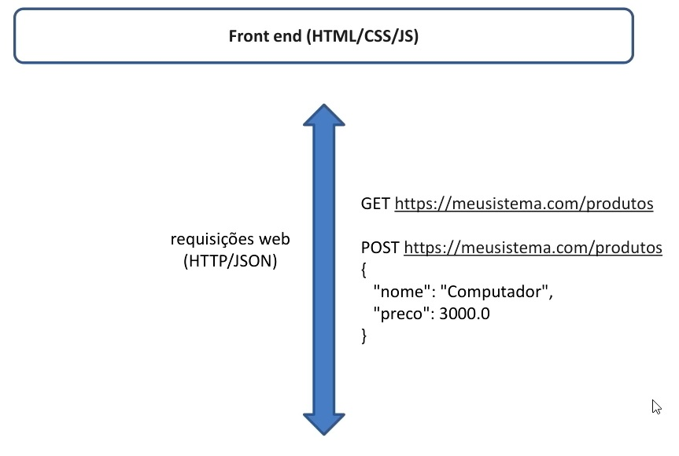
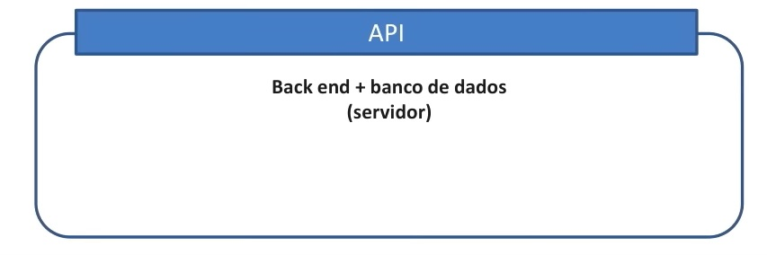

##
### JAVA SPRING
##

**Sistemas Web**

  

**API Rest**

  

  

**API Rest**

- **Padrão Rest**
  - Cliente/Servidor com HTTP
  - Comunicação stateless(*)
  - Interface uniforme, formato padronizaado
  - Cache
  - Sistema em camadas
  - Código sob demanda (opcional)

- https://www.redhat.com/pt-br/topics/api/what-is-a-rest-api

