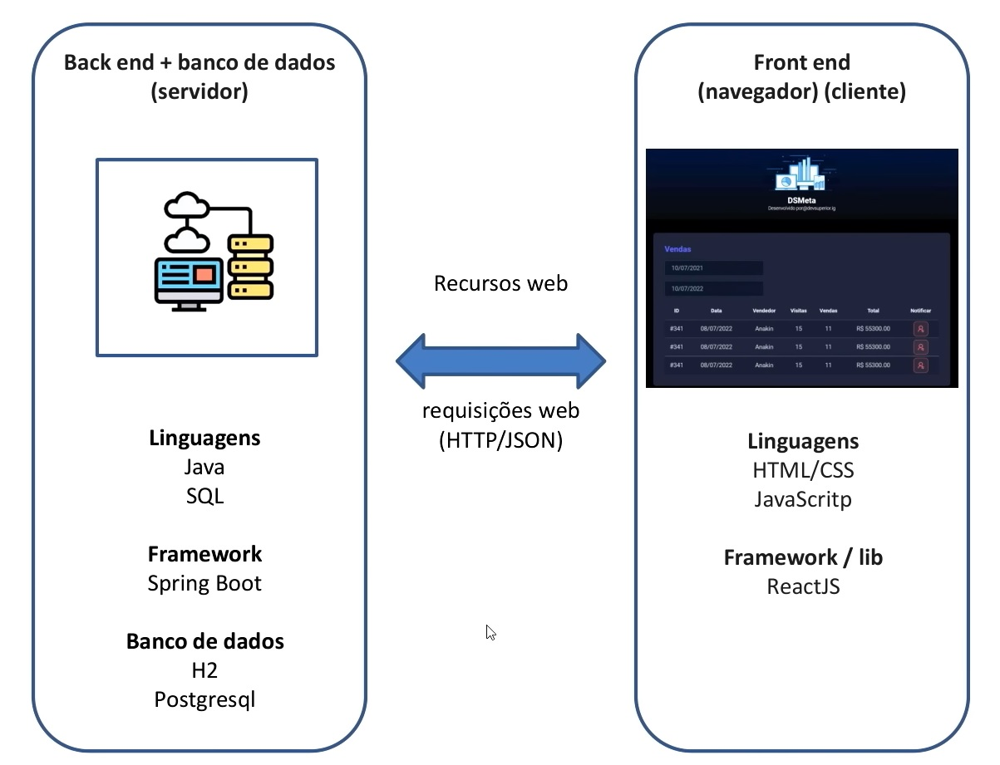

##
### JAVA SPRING
##

- Conceitos
- Sistemas web e recursos
- Cliente/servidor, HTTP, JSON
- Padrão Rest para API web
- Estruturação de projeto Spring Rest
- Entidades e ORM
- Database seeding
- Padrão camadas
- Controller, service, repository
- Padrão DTO

**Sistemas Web**

  

**API Rest**

  

  

**API Rest**

- **Padrão Rest**
  - Cliente/Servidor com HTTP
  - Comunicação stateless(*)
  - Interface uniforme, formato padronizaado
  - Cache
  - Sistema em camadas
  - Código sob demanda (opcional)

- https://www.redhat.com/pt-br/topics/api/what-is-a-rest-api

  

**Padrões Camadas**

  

- Criar projeto / lib Maven
- Salvar no Github
- Arquivos Properties, entidade Game, ORM
- Seed dos games
- GameMinDTO, GameRepository, GameService, GameController

